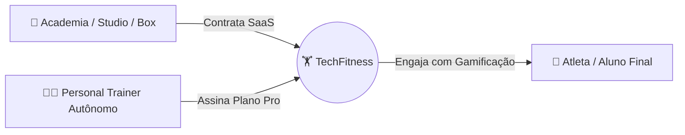

# 📊 Planejamento Estratégico: Analytics, Modelo de Negócio & Telemetria
> Documento originado pelo **Conselho de IAs** e **Especialista em UX** para o **TechFitness**.  
> **Status:** Em Planejamento (Aguardando Aprovação para Execução).

---

## 1. Contexto & Diagnóstico: Por que NÃO rastrear todos os botões manualmente?

O instinto inicial de novos produtos costuma ser adicionar telemetria manual em cada botão (`onClick={() => track()}`). No entanto, sob a ótica de engenharia de software e análise de produto, essa prática apresenta graves problemas:

1. **Poluição e Dívida Técnica:** Injetar chamadas de tracking em dezenas de componentes do Next.js aumenta o acoplamento, dificulta refatorações e suja componentes de apresentação.
2. **Degradação do Core Web Vitals (INP - Interaction to Next Paint):** Em celulares de entrada na academia com redes móveis oscilantes, disparar requisições HTTP adicionais em cada toque atrasa o feedback visual e passa sensação de lentidão.
3. **Cemitério de Dados (Data Swamp):** Rastrear cliques triviais (como "Fechar Modal", "Voltar", "Ver Mais") gera 95% de ruído e 5% de sinal útil, inflando custos de armazenamento sem gerar insights acionáveis.
4. **Riscos de Compliance e LGPD (ANPD):** O TechFitness lida com dados corporais e de saúde sensíveis (pesagens, biometria, fotos de avaliação). Capturar payloads sem rigor de anonimização viola normas de privacidade.

---

## 2. Benchmark Comparativo: PostHog vs. Outras Ferramentas

| Ferramenta | Pontos Fortes | Pontos Fracos | Modelo de Custo | Veredito para o TechFitness |
| :--- | :--- | :--- | :--- | :--- |
| **PostHog** ⭐ *(Recomendado para Produto)* | Suíte completa: Autocapture sem código, Gravações de Sessão, Heatmaps, Funis de Conversão, Feature Flags e Testes A/B em uma só plataforma. | Requer configuração de privacidade para mascarar dados sensíveis. | **Gratuito até 1M de eventos/mês** e 5.000 gravações. Depois, pague pelo que usar. | **Excelente escolha para entender o comportamento de produto** e funis de retenção do atleta. |
| **Microsoft Clarity** ⭐ *(Recomendado para UX inicial)* | 100% gratuito e ilimitado para sempre. Mapas de calor (cliques e scroll), gravações de tela e detecção de *rage clicks* com zero impacto de performance. | Não cria funis de conversão complexos nem métricas de negócio personalizadas. | **100% Gratuito sem limite.** | **Melhor custo-benefício imediato** para auditar a usabilidade e atrito visual sem gastar nada. |
| **Mixpanel / Amplitude** | Métricas de retenção de produto extremamente profundas e relatórios de cohort avançados. | Não possuem mapas de calor visuais nem gravações de sessão nativas. Curva de aprendizado íngreme. | Free tier limitado (100k eventos/mês); planos pagos ficam caros rapidamente. | Desnecessariamente complexo para a fase atual do projeto. |
| **Google Analytics 4 (GA4)** | Bom para tráfego orgânico, SEO e campanhas de marketing (Google Ads). | Interface confusa, péssimo para SaaS autenticado e não focado em jornadas de treino ou retenção B2B. | Gratuito. | Útil apenas na Landing Page institucional (`/`), dispensável dentro do app logado. |

> 💡 **Recomendação de Stack:**  
> - **Fase 1 (Validação & UX):** **Microsoft Clarity** injetado no layout para mapas de calor e gravações de sessão (Custo R$ 0,00).  
> - **Fase 2 (Escala & Funis de Retenção):** Migrar para **PostHog** para monitorar o funil de treino e feature flags dos planos pagos.

---

## 3. Quem é o Cliente do TechFitness? (ICP & Personas)

Para estruturar a telemetria e o modelo de negócio, é fundamental diferenciar **quem paga** de **quem usa**:



### Perfil 1: Personal Trainers e Assessorias Esportivas (B2B Individual)
- **Quem é:** Treinador autônomo com carteira de 15 a 80 alunos (presenciais e consultorias online).
- **Dor Central:** Perde horas montando treinos no WhatsApp/Excel, tem dificuldade em cobrar e não consegue provar visualmente a evolução do aluno para justificar seu preço.
- **Valor no TechFitness:** Copilot de IA para montar treinos em 2 minutos, gráficos biométricos para impressionar o aluno e controle de assiduidade.

### Perfil 2: Academias, Studios e Boxes de Cross/Funcional (B2B Institucional)
- **Quem é:** Dono ou gestor de academia com 100 a 800 alunos e equipe de 3 a 10 professores.
- **Dor Central:** Evasão massiva de alunos (churn de academia gira em torno de 10% a 15% ao mês) por falta de acompanhamento individualizado e rotinas monótonas.
- **Valor no TechFitness:** Gamificação (Liga dos Titãs e Mural) que cria espírito de comunidade, alertas precoces de alunos em risco de desistência e padronização da equipe de professores.

---

## 4. Modelagem de Negócio & Monetização SaaS

Análise dos 3 modelos de precificação para o TechFitness:

### Opção A: Fixo por Mês (Flat Fee)
- *Exemplo:* R$ 99,00/mês fixo para o personal, com alunos ilimitados.
- **Problema:** Desalinhamento de valor. O personal com 5 alunos paga o mesmo que o personal com 150 alunos (que consome muito mais banco de dados, storage de fotos e chamadas de IA).

### Opção B: Cobrança Pura por Aluno (Per-Seat)
- *Exemplo:* R$ 5,00 por aluno ativo por mês.
- **Problema:** Cria barreira psicológica ("fricção de cadastro"). O treinador evita cadastrar alunos novos com medo de a fatura subir no final do mês.

### 🏆 Opção C: Modelo Híbrido com Franquia Base + Excedente (RECOMENDADO)
O modelo híbrido oferece **previsibilidade de receita (MRR)** para o TechFitness, custo de entrada acessível para o treinador e expansão automática de receita conforme ele cresce (*expansion revenue*):

```text
┌────────────────────────────────────────────────────────────────────────┐
│                      ESTRUTURA SUGERIDA DE PLANOS                      │
├────────────────────────────────┬───────────────────┬───────────────────┤
│ Plano Starter (Personal Solo)  │ Plano Pro (Assessoria)│ Plano Academia/Studio │
│ R$ 69,90 / mês                 │ R$ 149,90 / mês   │ R$ 349,90 / mês   │
│ • Até 15 alunos inclusos       │ • Até 45 alunos   │ • Até 120 alunos  │
│ • + R$ 3,50 / aluno extra      │ • + R$ 2,50/extra │ • Multi-professor │
│ • Copilot de IA incluso        │ • Gráficos avanç. │ • + R$ 1,80/extra │
└────────────────────────────────┴───────────────────┴───────────────────┘
```

**Por que este modelo híbrido é superior?**
1. **Piso de Faturamento Garantido:** O TechFitness assegura uma receita previsível todo mês, cobrindo os custos de infraestrutura (Supabase, Vercel, APIs de IA).
2. **Sem Barreira de Entrada:** Um personal iniciando consegue pagar R$ 69,90 sem hesitar.
3. **Upsell Orgânico:** Conforme os alunos do personal têm resultados e indicam amigos, o faturamento do TechFitness cresce automaticamente sem necessidade de uma nova venda.

---

## 5. A Solução Técnica: Arquitetura de Métricas em 2 Camadas


### Camada 1: Usabilidade & Mapas de Calor (Zero Código nos Botões)
- **Ferramenta:** Microsoft Clarity ou PostHog.
- **Funcionamento:** Um único script leve (~15KB) no `layout.tsx`.
- **Benefícios:** Heatmaps automáticos, gravações de sessões reais e zero acoplamento no código.

### Camada 2: Os 5 Eventos de Ouro do Core Loop (Valor de Negócio)

| Evento | Disparo | Propriedades Chave | Decisão de Produto / Ação |
| :--- | :--- | :--- | :--- |
| `workout_started` | Atleta clica em "Iniciar Treino" na Hora do Show | `planId`, `planName`, `totalExercises`, `source` | Medir taxa de início de rotinas prescritas. |
| `workout_completed` | Atleta finaliza a sessão de treino | `durationSeconds`, `completedSets`, `rpe`, `streak` | Medir abandono (*drop-off*) durante a execução. |
| `weight_registered` | Atleta ou treinador registra pesagem | `weight`, `hasBodyFat`, `hasCircumferences` | Medir engajamento com evolução corporal. |
| `photo_checkin_posted` | Atleta publica foto do treino no mural | `studentId`, `hasPhoto` | Medir adesão ao efeito de rede comunitário. |
| `plan_created_by_trainer` | Treinador prescreve ficha (Manual ou IA) | `trainerId`, `isAiGenerated`, `exercisesCount` | Medir produtividade e adoção do Copilot de IA. |

---

## 6. Modelo de Implementação Técnica Futura

### Utilitário Centralizador (`src/lib/analytics.ts`)
Quando for aprovada a implementação, um único módulo gerenciará os envios de forma assíncrona e sem bloquear a UI:

```typescript
// Exemplo de arquitetura futura para src/lib/analytics.ts
type TechFitnessEvent =
  | { name: "workout_started"; properties: { planId: string; planName: string } }
  | { name: "workout_completed"; properties: { durationSeconds: number; sets: number } }
  | { name: "weight_registered"; properties: { hasBodyFat: boolean } }
  | { name: "photo_checkin_posted"; properties: { hasPhoto: boolean } }
  | { name: "plan_created_by_trainer"; properties: { isAiGenerated: boolean } };

export function trackEvent<E extends TechFitnessEvent>(
  eventName: E["name"],
  properties: E["properties"]
) {
  if (typeof window === "undefined" || process.env.NODE_ENV === "development") {
    return;
  }

  const payload = JSON.stringify({
    event: eventName,
    properties,
    timestamp: new Date().toISOString(),
  });

  if (navigator.sendBeacon) {
    navigator.sendBeacon("/api/telemetry", payload);
  } else {
    fetch("/api/telemetry", {
      method: "POST",
      headers: { "Content-Type": "application/json" },
      body: payload,
      keepalive: true,
    }).catch(() => {});
  }
}
```

---

## 7. Diretrizes de Segurança & Privacidade (LGPD)

1. **Anonimização de PII:** Nunca enviar nomes completos, e-mails, senhas ou URLs de fotos corporais nos payloads de telemetria.
2. **Identificadores Pseudonimizados:** Utilizar apenas IDs randômicos opacos (ex: `user_cly...`).
3. **Máscara de Dados nos Mapas de Calor:** Configurar o script de heatmap com a flag `mask-all-text: true` para garantir que pesagens e anotações pessoais do aluno fiquem ocultas nas gravações.

---

## 8. Roadmap dos Próximos Passos (Quando For Executar)

- [ ] **Fase 1:** Ativar Microsoft Clarity no `src/app/layout.tsx` para validação de calor e atrito sem custo.
- [ ] **Fase 2:** Definir precificação oficial dos planos no Stripe/Asaas (Modelo Híbrido com faixa base + excedente).
- [ ] **Fase 3:** Implementar `src/lib/analytics.ts` conectando os 5 Eventos de Ouro.
- [ ] **Fase 4:** Criar painel de Alunos em Risco de Churn para os professores (alunos inativos há +7 dias).
