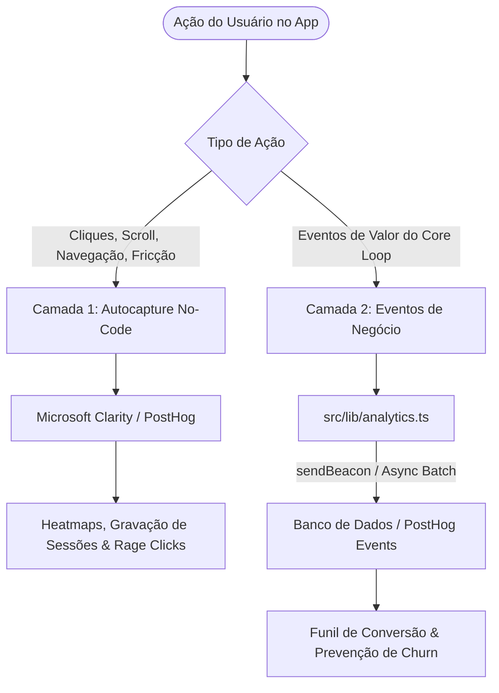

# 📊 Planejamento Estratégico: Analytics, Telemetria & Rastreabilidade Inteligente
> Documento originado pelo **Conselho de IAs** e **Especialista em UX** para o **TechFitness**.  
> **Status:** Em Planejamento (Aguardando Aprovação para Execução).

---

## 1. Contexto & Diagnóstico: Por que NÃO rastrear todos os botões manualmente?

O instinto inicial de novos produtos costuma ser adicionar telemetria manual em cada botão (`onClick={() => track()}`). No entanto, sob a ótica de engenharia de software e análise de produto, essa prática apresenta graves problemas:

1. **Poluição e Dívida Técnica:** Injetar chamadas de tracking em dezenas de componentes do Next.js aumenta o acoplamento, dificulta refatorações e suja componentes de apresentação.
2. **Degradação do Core Web Vitals (INP - Interaction to Next Paint):** Em celulares de entrada na academia com redes móveis oscilantes, disparar requisições HTTP adicionais em cada toque atrasa o feedback visual e passa sensação de lentidão.
3. **Cemitério de Dados (Data Swamp):** Rastrear cliques triviais (como "Fechar Modal", "Voltar", "Ver Mais") gera 95% de ruído e 5% de sinal útil, inflando custos de armazenamento sem gerar insights acionáveis.
4. **Riscos de Compliance e LGPD (ANPD):** O TechFitness lida com dados corporais e de saúde sensíveis (pesagens, biometria, fotos de avaliação). Capturar payloads sem rigor de anonimização viola normas de privacidade.

---

## 2. A Solução: Arquitetura de Métricas em 2 Camadas

Em vez de código espalhado por todos os botões, adotaremos uma **arquitetura moderna desacoplada em duas camadas**:



---

### Camada 1: Usabilidade & Mapas de Calor (Zero Código nos Componentes)
Para saber **onde o usuário clica**, onde ele hesita ou onde ocorrem cliques de raiva (*rage clicks*):
- **Ferramenta Recomendada:** **Microsoft Clarity** (100% gratuito, sem limite de tráfego, em conformidade com GDPR/LGPD) ou **PostHog Autocapture**.
- **Como Funciona:** Um único script leve (~15KB) injetado no `src/app/layout.tsx`.
- **Benefícios:**
  - Gera **Mapas de Calor (Heatmaps)** automáticos de todas as telas (mobile e desktop).
  - Grava sessões anônimas para identificar gargalos de UX em tempo real.
  - Zero poluição no código fonte dos botões.
  - Máscara automática de privacidade para campos de senha e dados sensíveis.

---

### Camada 2: Os 5 Eventos de Ouro do Core Loop (Valor de Negócio)
Para acompanhar a **retenção**, **ativação** e **consistência** dos atletas e treinadores, rastrearemos estritamente os eventos que impactam o modelo de negócio:

| Evento | Disparo | Propriedades Chave | Decisão de Produto / Ação |
| :--- | :--- | :--- | :--- |
| `workout_started` | Atleta clica em "Iniciar Treino" na Hora do Show | `planId`, `planName`, `totalExercises`, `source` | Medir taxa de início de rotinas prescritas. |
| `workout_completed` | Atleta finaliza a sessão de treino | `durationSeconds`, `completedSets`, `rpe`, `streak` | Medir abandono (*drop-off*) durante a execução. |
| `weight_registered` | Atleta ou treinador registra pesagem | `weight`, `hasBodyFat`, `hasCircumferences` | Medir engajamento com evolução corporal. |
| `photo_checkin_posted` | Atleta publica foto do treino no mural | `studentId`, `hasPhoto` | Medir adesão ao efeito de rede comunitário. |
| `plan_created_by_trainer` | Treinador prescreve ficha (Manual ou IA) | `trainerId`, `isAiGenerated`, `exercisesCount` | Medir produtividade e adoção do Copilot de IA. |

---

## 3. Modelo de Implementação Técnica Futura

### Utilitário Centralizador (`src/lib/analytics.ts`)
Quando for aprovada a implementação, um único módulo gerenciará os envios de forma assíncrona, tolerante a falhas e sem bloquear a thread principal:

```typescript
// Exemplo de arquitetura futura para src/lib/analytics.ts
type TechFitnessEvent =
  | { name: "workout_started"; properties: { planId: string; planName: string } }
  | { name: "workout_completed"; properties: { durationSeconds: number; sets: number } }
  | { name: "weight_registered"; properties: { hasBodyFat: boolean } }
  | { name: "photo_checkin_posted"; properties: { hasPhoto: boolean } }
  | { name: "plan_created_by_trainer"; properties: { isAiGenerated: boolean } };

export function trackEvent<E extends TechFitnessEvent>(
  eventName: E["name"],
  properties: E["properties"]
) {
  // Evitar chamadas em ambientes de teste ou SSR
  if (typeof window === "undefined" || process.env.NODE_ENV === "development") {
    return;
  }

  const payload = JSON.stringify({
    event: eventName,
    properties,
    timestamp: new Date().toISOString(),
  });

  // Usar sendBeacon para envio ultra-leve que não bloqueia navegação nem UI
  if (navigator.sendBeacon) {
    navigator.sendBeacon("/api/telemetry", payload);
  } else {
    fetch("/api/telemetry", {
      method: "POST",
      headers: { "Content-Type": "application/json" },
      body: payload,
      keepalive: true,
    }).catch(() => {});
  }
}
```

---

## 4. Diretrizes de Segurança & Privacidade (LGPD)

1. **Anonimização de PII:** Nunca enviar nomes completos, e-mails, senhas ou URLs de fotos corporais nos payloads de telemetria.
2. **Identificadores Pseudonimizados:** Utilizar apenas IDs randômicos opacos (ex: `user_cly...`).
3. **Máscara de Dados nos Mapas de Calor:** Configurar o script de heatmap com a flag `mask-all-text: true` para garantir que pesagens e anotações pessoais do aluno fiquem ocultas nas gravações.

---

## 5. Roadmap dos Próximos Passos (Quando for Implementar)

- [ ] **Etapa 1:** Criar conta no Microsoft Clarity e obter o ID do projeto.
- [ ] **Etapa 2:** Inserir o script leve no `src/app/layout.tsx` ativado apenas em produção.
- [ ] **Etapa 3:** Criar o arquivo `src/lib/analytics.ts` com tipagem estrita para os 5 eventos chave.
- [ ] **Etapa 4:** Acoplar o disparo nos 5 pontos críticos (finalização de treino, pesagem e criação de fichas).
- [ ] **Etapa 5:** Exibir card de "Alunos em Risco de Churn" no dashboard do professor (alunos sem treino há +7 dias).
